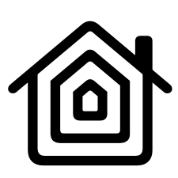

#  HomeKitDotNet 
* A 100% native implementation of a HomeKit Controller in dotnet
* Works on all architectures and operating systems without dependencies
* Implements all 243 characteristics and 71 services

#### Working:
* Pairing
* Connection Management
* Reading and writing characteristics
* Eventing

#### TODO:
* More Examples

#### Other Projects:
* Check out my other projects for [ZWave](https://github.com/SmartHomeOS/ZWaveDotNet) and [Matter](https://github.com/SmartHomeOS/MatterDotNet).

Support is always appreciated: 

Note:
This library is not affiliated with or endorsed by Apple